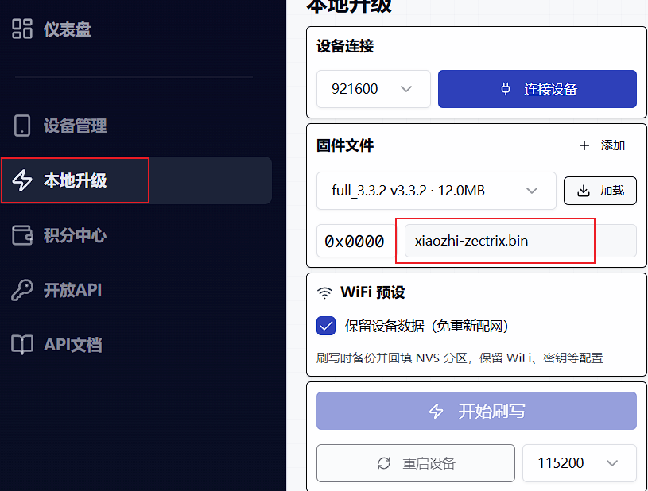
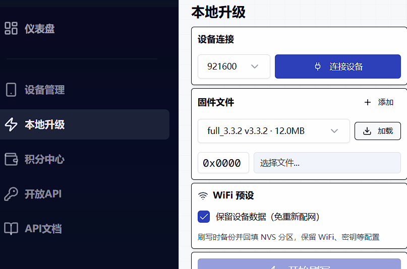

# 基于小智的zectrix魔改版

感谢[极趣科技zectrix](https://wiki.zectrix.com/zh/software/opensource) 优秀的硬件设计和超高的可玩性。

项目固件完全基于[小智](https://github.com/78/xiaozhi-esp32)做的二次开发，主要兼容了zectrix的硬件。添加了一些显示的优化。

## 功能介绍
跟小智现有操作完全一样

👉 [Human: Give AI a camera vs AI: Instantly finds out the owner hasn't washed hair for three days【bilibili】](https://www.bilibili.com/video/BV1bpjgzKEhd/)

👉 [Handcraft your AI girlfriend, beginner's guide【bilibili】](https://www.bilibili.com/video/BV1XnmFYLEJN/)

## 怎么刷固件
方法跟刷小智是一样的，你直接拿xiaozhi.bin文件刷即可。
要是没工具的，也可以直接在极趣云平台刷：
1. 到[极趣云平台](https://www.zectrix.com/)，在后台的本地升级
2. 电脑插上设置，点连接设备->选择文件（build目录下，xiaozhi.bin文件）
3. 开始刷写

## 刷坏了怎么办

不要怕，回到[极趣云平台](https://www.zectrix.com/)，在后台的本地升级重新刷回来即可

### Development Environment

- Cursor or VSCode
- Install ESP-IDF plugin, select SDK version 5.4 or above
- Linux is better than Windows for faster compilation and fewer driver issues
- This project uses Google C++ code style, please ensure compliance when submitting code

### Developer Documentation

- [Custom Board Guide](docs/custom-board.md) - Learn how to create custom boards for XiaoZhi AI
- [MCP Protocol IoT Control Usage](docs/mcp-usage.md) - Learn how to control IoT devices via MCP protocol
- [MCP Protocol Interaction Flow](docs/mcp-protocol.md) - Device-side MCP protocol implementation
- [MQTT + UDP Hybrid Communication Protocol Document](docs/mqtt-udp.md)
- [A detailed WebSocket communication protocol document](docs/websocket.md)

## Large Model Configuration

If you already have a XiaoZhi AI chatbot device and have connected to the official server, you can log in to the [xiaozhi.me](https://xiaozhi.me) console for configuration.

👉 [Backend Operation Video Tutorial (Old Interface)](https://www.bilibili.com/video/BV1jUCUY2EKM/)

## Related Open Source Projects

For server deployment on personal computers, refer to the following open-source projects:

- [xinnan-tech/xiaozhi-esp32-server](https://github.com/xinnan-tech/xiaozhi-esp32-server) Python server
- [joey-zhou/xiaozhi-esp32-server-java](https://github.com/joey-zhou/xiaozhi-esp32-server-java) Java server
- [AnimeAIChat/xiaozhi-server-go](https://github.com/AnimeAIChat/xiaozhi-server-go) Golang server
- [hackers365/xiaozhi-esp32-server-golang](https://github.com/hackers365/xiaozhi-esp32-server-golang) Golang server

Other client projects using the XiaoZhi communication protocol:

- [huangjunsen0406/py-xiaozhi](https://github.com/huangjunsen0406/py-xiaozhi) Python client
- [TOM88812/xiaozhi-android-client](https://github.com/TOM88812/xiaozhi-android-client) Android client
- [100askTeam/xiaozhi-linux](http://github.com/100askTeam/xiaozhi-linux) Linux client by 100ask
- [78/xiaozhi-sf32](https://github.com/78/xiaozhi-sf32) Bluetooth chip firmware by Sichuan
- [QuecPython/solution-xiaozhiAI](https://github.com/QuecPython/solution-xiaozhiAI) QuecPython firmware by Quectel

Custom Assets Tools:

- [78/xiaozhi-assets-generator](https://github.com/78/xiaozhi-assets-generator) Custom Assets Generator (Wake words, fonts, emojis, backgrounds)

## About the Project

This is an open-source ESP32 project, released under the MIT license, allowing anyone to use it for free, including for commercial purposes.

We hope this project helps everyone understand AI hardware development and apply rapidly evolving large language models to real hardware devices.

If you have any ideas or suggestions, please feel free to raise Issues or join our [Discord](https://discord.gg/C759fGMBcZ) or QQ group: 994694848

## Star History

<a href="https://star-history.com/#78/xiaozhi-esp32&Date">
 <picture>
   <source media="(prefers-color-scheme: dark)" srcset="https://api.star-history.com/svg?repos=78/xiaozhi-esp32&type=Date&theme=dark" />
   <source media="(prefers-color-scheme: light)" srcset="https://api.star-history.com/svg?repos=78/xiaozhi-esp32&type=Date" />
   
 </picture>
</a>
